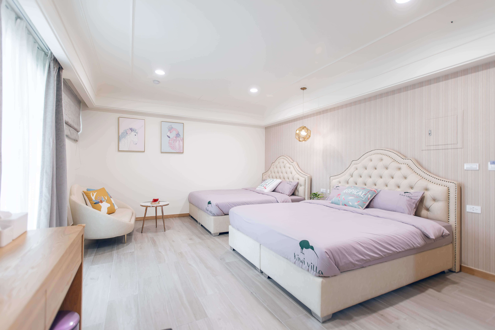

# 澎湖期遇度假會館 - 圖片優化分析報告

> 分析日期: 2025-11-02
> 分析範圍: 全站圖片資源 (images/ 目錄)
> 目的: 評估圖片使用合理性，提供優化建議

---

## 目錄

- [一、整體概況](#一整體概況)
- [二、問題與風險](#二問題與風險)
- [三、優化建議](#三優化建議)
- [四、實作指南](#四實作指南)
- [五、圖片大小標準](#五圖片大小標準)
- [六、優先級與時程](#六優先級與時程)
- [七、檢核清單](#七檢核清單)

---

## 一、整體概況

### 統計數據

| 項目 | 數量/大小 |
|------|----------|
| **圖片總數** | 237 個檔案 |
| **總容量** | 59 MB |
| **JPG 檔案** | 109 個 (46%) |
| **WebP 檔案** | 117 個 (49%) |
| **AVIF 檔案** | 11 個 (5%) |
| **PNG 檔案** | 少量 (Logo/Favicon) |

### 目錄結構

```
images/
├── hero/           # 首頁主視覺 (22 檔案, ~8 MB)
├── intro/          # 會館介紹 (20 檔案, ~7 MB)
├── rooms/          # 房型圖片 (160+ 檔案, ~35 MB)
│   ├── deluxeQuad/
│   ├── luxuryFamily/
│   ├── premiumDouble/
│   ├── premiumQuad/
│   ├── premiumTriple/
│   └── premiumTwin/
├── facilities/     # 設施圖片 (6 檔案, ~3.4 MB)
├── location/       # 地理位置 (5 檔案, ~500 KB)
├── logo/           # Logo 和 Favicon (20+ 檔案, ~300 KB)
├── reviews/        # 評價頁 OG (1 檔案, 71 KB)
├── faq/            # FAQ 頁 OG (1 檔案, 71 KB)
└── policy/         # 隱私頁 OG (1 檔案, 71 KB)
```

---

## 二、問題與風險

### 🔴 嚴重問題

#### 1. 超大檔案 (>1MB)

| 檔案路徑 | 大小 | 問題 |
|---------|------|------|
| `images/hero/main-hall-environment.jpg` | 2.9 MB | 極度過大，嚴重影響首頁載入 |
| `images/rooms/premiumTwin/penghu-kiwi-villa-premium-twin-room4.jpg` | 1.5 MB | 過大，拖慢頁面效能 |
| `images/rooms/premiumTriple/penghu-kiwi-villa-premium-triple-room8.jpg` | 1.4 MB | 過大，拖慢頁面效能 |
| `images/rooms/premiumDouble/penghu-kiwi-villa-premium-double-room10.jpg` | 999 KB | 接近 1MB，需優化 |

**影響**:
- 首頁 LCP (Largest Contentful Paint) 過長
- 行動裝置用戶體驗差
- 消耗大量流量

#### 2. 大量 500KB+ 的 JPG 檔案

**統計**: 共 36 個檔案超過 500 KB

**主要分布**:
- `images/facilities/` - 6 個檔案 (533-585 KB)
- `images/intro/` - 7 個檔案 (533-585 KB)
- `images/rooms/` - 23+ 個檔案 (500-900 KB)

**列表**:
```
facilities/bed-set.jpg                 575 KB
facilities/dining-area.jpg             533 KB
facilities/electric-curtains.jpg       566 KB
facilities/elevator.jpg                581 KB
facilities/furniture-table-chairs.jpg  585 KB
facilities/main-hall.jpg               584 KB

intro/bed-set.jpg                      575 KB
intro/dining-area.jpg                  533 KB
intro/electric-curtains.jpg            566 KB
intro/elevator.jpg                     581 KB
intro/furniture-table-chairs.jpg       585 KB
intro/main-hall.jpg                    584 KB

rooms/deluxe-quad-room.jpg             585 KB
rooms/deluxeQuad/*                     (多個 500KB+ 檔案)
rooms/premium-triple-room-3.jpg        756 KB
rooms/premium-triple-room.jpg          700 KB
rooms/premium-twin-room.jpg            636 KB
... (更多房型圖片)
```

#### 3. 重複檔案浪費

`facilities/` 和 `intro/` 目錄存在 **完全重複** 的 6 個圖片:

| 檔案名稱 | 大小 | 重複次數 | 浪費空間 |
|---------|------|----------|----------|
| bed-set.jpg | 575 KB | 2 | 575 KB |
| dining-area.jpg | 533 KB | 2 | 533 KB |
| electric-curtains.jpg | 566 KB | 2 | 566 KB |
| elevator.jpg | 581 KB | 2 | 581 KB |
| furniture-table-chairs.jpg | 585 KB | 2 | 585 KB |
| main-hall.jpg | 584 KB | 2 | 584 KB |
| **總計** | - | - | **~3.4 MB** |

**建議**: 移除重複檔案，使用單一來源或符號連結。

### 🟡 中度問題

#### 4. WebP 檔案仍偏大

| 檔案路徑 | 大小 | 建議 |
|---------|------|------|
| `images/intro/restaurant.webp` | 842 KB | 應 < 200 KB |
| `images/intro/lobby.webp` | 787 KB | 應 < 200 KB |
| `images/hero/main-hall-environment.webp` | 724 KB | 應 < 150 KB |

**問題**: WebP 未充分壓縮，失去格式優勢。

#### 5. AVIF 格式覆蓋不足

**現況**:
- 僅有 11 個 AVIF 檔案 (佔總數 5%)
- 主要集中在 hero 和 logo
- 房型相簿 **完全缺少** AVIF 格式

**AVIF 檔案清單**:
```
images/hero/main-hall-environment-mobile-extreme.avif    22 KB  ✓
images/hero/main-hall-environment-mobile-new.avif        40 KB  ✓
images/hero/main-hall-environment-mobile-ultra-compressed.avif  37 KB  ✓
images/hero/main-hall-environment-mobile.avif           607 KB  (需優化)
images/hero/main-hall-environment-new.avif              154 KB  ✓
images/hero/main-hall-environment.avif                  607 KB  (需優化)
images/intro/main-hall.avif                              87 KB  ✓
images/line-icon.avif                                   2.5 KB  ✓
images/logo/kiwi-villa-logo-small.avif                  1.0 KB  ✓
images/logo/kiwi-villa-logo.avif                         37 KB  ✓
images/location/penghu-map.avif                          32 KB  ✓
```

**影響**:
- 錯失 AVIF 高壓縮率優勢 (比 WebP 小 30-50%)
- 現代瀏覽器用戶無法享受最佳效能

#### 6. 缺少響應式圖片尺寸

**問題**:
- 房型相簿圖片沒有提供多尺寸版本
- 手機用戶下載完整桌面版圖片
- 浪費流量和載入時間

**範例**:
```html
<!-- 現況: 所有裝置載入同一張大圖 -->


<!-- 建議: 根據裝置提供不同尺寸 -->
<picture>
  <source srcset="room-400w.avif 400w, room-800w.avif 800w"
          sizes="(max-width: 768px) 400px, 800px" type="image/avif">
  <source srcset="room-400w.webp 400w, room-800w.webp 800w"
          sizes="(max-width: 768px) 400px, 800px" type="image/webp">
  
</picture>
```

### 🟢 做得好的地方

#### 1. 格式選擇正確
```html
<picture>
  <source srcset="image.avif" type="image/avif">   <!-- 最優先 -->
  <source srcset="image.webp" type="image/webp">   <!-- 次選 -->
                     <!-- 回退 -->
</picture>
```

#### 2. Hero 圖片響應式優化
- 提供手機版專用圖片 (mobile-extreme, mobile-ultra)
- 使用 preload 提升關鍵圖片載入
- 媒體查詢分別處理桌面和手機

#### 3. 懶載入實作
- 非首屏圖片使用 `loading="lazy"`
- 減少初始載入負擔

#### 4. Favicon 完整性
- 提供多尺寸 favicon (16x16 到 512x512)
- Apple touch icon 完整配置
- PWA manifest.json 設定

---

## 三、優化建議

### 🎯 立即執行 (高優先級)

#### 建議 1: 刪除重複檔案

**操作**:
1. 保留 `facilities/` 目錄的圖片
2. 刪除 `intro/` 目錄中的重複檔案
3. 更新 `intro.html` 的圖片路徑指向 `../facilities/`

**預期節省**: 3.4 MB

**範例**:
```html
<!-- intro.html 中修改 -->
<!-- 原本 -->


<!-- 修改為 -->

```

#### 建議 2: 壓縮超大 JPG

**工具**:
- [Squoosh](https://squoosh.app/) - Google 開發的線上工具
- [TinyJPG](https://tinyjpg.com/) - 線上批次壓縮
- ImageOptim (macOS) - 本地工具

**參數設定**:
- JPG 品質: 80-85%
- 移除 EXIF 資料
- 漸進式 JPG (Progressive)

**目標大小**:
| 圖片類型 | 目標大小 |
|---------|---------|
| Hero 圖片 | < 200 KB |
| 房型圖片 | < 150 KB |
| 設施圖片 | < 100 KB |

**預期節省**: 15-20 MB

**優先處理清單**:
```
1. images/hero/main-hall-environment.jpg (2.9 MB → 200 KB)
2. images/rooms/premiumTwin/room4.jpg (1.5 MB → 150 KB)
3. images/rooms/premiumTriple/room8.jpg (1.4 MB → 150 KB)
4. images/rooms/premiumDouble/room10.jpg (999 KB → 150 KB)
5. facilities/ 下所有 JPG (575 KB → 100 KB)
6. intro/ 下所有 JPG (如未刪除重複檔)
```

#### 建議 3: 生成 AVIF 版本

**範圍**:
- 所有房型主圖
- 大型 WebP 圖片 (>200 KB)
- 設施圖片

**工具**:
- Squoosh (手動處理)
- avif-cli (批次處理): `npm install -g avif`

**範例命令**:
```bash
# 批次轉換
for file in images/rooms/*.jpg; do
  avif --input "$file" --output "${file%.jpg}.avif" --quality 65
done
```

**預期節省**: 8-12 MB (相較於 WebP 再減少 30-50%)

### 🔧 次要優化

#### 建議 4: 實作響應式圖片尺寸

**生成多尺寸版本**:
- 400w (手機)
- 800w (平板/小桌面)
- 1200w (桌面)

**範例**:
```html
<picture>
  <source
    srcset="room-400w.avif 400w, room-800w.avif 800w, room-1200w.avif 1200w"
    sizes="(max-width: 768px) 400px, (max-width: 1200px) 800px, 1200px"
    type="image/avif">
  <source
    srcset="room-400w.webp 400w, room-800w.webp 800w, room-1200w.webp 1200w"
    sizes="(max-width: 768px) 400px, (max-width: 1200px) 800px, 1200px"
    type="image/webp">
  
</picture>
```

#### 建議 5: Cloudflare Images 整合

考慮使用 Cloudflare Pages 的圖片優化功能:
- 自動格式轉換
- 自動尺寸調整
- CDN 加速

**實作方式**:
```html
<!-- 使用 Cloudflare Image Resizing -->

```

#### 建議 6: 優化懶載入策略

**改進點**:
```javascript
// 使用 Intersection Observer 提前載入
const imageObserver = new IntersectionObserver((entries, observer) => {
  entries.forEach(entry => {
    if (entry.isIntersecting) {
      const img = entry.target;
      img.src = img.dataset.src;
      img.classList.remove('lazy');
      observer.unobserve(img);
    }
  });
}, {
  rootMargin: '50px 0px' // 提前 50px 開始載入
});
```

---

## 四、實作指南

### 步驟 1: 刪除重複檔案

```bash
# 1. 備份
cp -r images/intro images/intro.backup

# 2. 刪除重複檔案
cd images/intro
rm bed-set.jpg dining-area.jpg electric-curtains.jpg elevator.jpg furniture-table-chairs.jpg main-hall.jpg

# 3. 更新 intro.html 中的路徑
# 將所有 images/intro/[檔名].jpg 改為 images/facilities/[檔名].jpg
```

**驗證**:
- 檢查 intro.html 頁面圖片是否正常顯示
- 確認沒有 404 錯誤

### 步驟 2: 批次壓縮 JPG

**使用 Squoosh CLI**:
```bash
# 安裝
npm install -g @squoosh/cli

# 壓縮單一檔案
squoosh-cli --mozjpeg '{"quality":85}' images/hero/main-hall-environment.jpg

# 批次壓縮
squoosh-cli --mozjpeg '{"quality":85}' images/rooms/**/*.jpg
```

**手動處理** (推薦用於關鍵圖片):
1. 前往 https://squoosh.app/
2. 上傳圖片
3. 選擇 MozJPEG 編碼器
4. 調整品質到 85%
5. 比較檔案大小和視覺品質
6. 下載並替換原檔案

### 步驟 3: 生成 AVIF

**使用 Squoosh CLI**:
```bash
# 為所有房型圖片生成 AVIF
find images/rooms -name "*.jpg" -type f | while read file; do
  squoosh-cli --avif '{"cqLevel":33,"speed":4}' "$file"
done
```

**參數說明**:
- `cqLevel`: 33-40 (數字越小品質越好)
- `speed`: 0-10 (數字越小壓縮越好但越慢)

### 步驟 4: 更新 HTML

**範例修改** (rooms.html):
```html
<!-- 原本 -->


<!-- 修改為 -->
<picture>
  <source srcset="images/rooms/premium-double-room.avif" type="image/avif">
  <source srcset="images/rooms/premium-double-room.webp" type="image/webp">
  
</picture>
```

### 步驟 5: 測試與驗證

**本地測試**:
```bash
# 啟動本地伺服器
python -m http.server 8000

# 或
npx live-server --port=8000
```

**檢查項目**:
- [ ] 所有頁面圖片正常顯示
- [ ] 瀏覽器載入正確的格式 (Chrome 應載入 AVIF)
- [ ] 懶載入正常運作
- [ ] 手機版顯示正確

**效能測試**:
- [PageSpeed Insights](https://pagespeed.web.dev/)
- [WebPageTest](https://www.webpagetest.org/)
- Chrome DevTools > Lighthouse

### 步驟 6: 部署與監控

```bash
# Git 提交
git add images/
git commit -m "optimize: 壓縮圖片並新增 AVIF 格式

- 刪除 intro/ 中的重複檔案 (-3.4 MB)
- 壓縮所有大於 500KB 的 JPG (-15 MB)
- 為房型圖片新增 AVIF 格式 (-8 MB)
- 更新相關 HTML 檔案

總計減少約 26 MB"

# 推送到遠端
git push origin main
```

**部署後檢查**:
- Cloudflare Pages 建置成功
- 生產環境圖片正常載入
- PageSpeed Insights 分數提升

---

## 五、圖片大小標準

### 桌面版圖片

| 圖片類型 | AVIF | WebP | JPG | 備註 |
|---------|------|------|-----|------|
| Hero 全寬背景 | 100-150 KB | 150-200 KB | 200-250 KB | 1920x1080 |
| 房型主圖 | 40-60 KB | 60-80 KB | 80-120 KB | 800x600 |
| 房型相簿 | 40-60 KB | 60-80 KB | 80-120 KB | 800x600 |
| 設施圖片 | 30-50 KB | 50-70 KB | 70-100 KB | 800x600 |
| 地圖圖片 | 30-40 KB | 40-50 KB | 50-70 KB | 600x400 |

### 行動版圖片

| 圖片類型 | AVIF | WebP | JPG | 備註 |
|---------|------|------|-----|------|
| Hero 背景 | 30-50 KB | 50-70 KB | 70-100 KB | 768x432 |
| 房型主圖 | 20-30 KB | 30-40 KB | 40-60 KB | 400x300 |
| 設施圖片 | 15-25 KB | 25-35 KB | 35-50 KB | 400x300 |

### Logo 與 Icon

| 圖片類型 | 格式 | 大小 | 備註 |
|---------|------|------|------|
| 主要 Logo | AVIF/WebP | < 50 KB | 使用 SVG 更佳 |
| 小型 Logo | AVIF/WebP | < 5 KB | 導航列使用 |
| Favicon | PNG | < 10 KB | 各尺寸 |
| Apple Touch Icon | PNG | < 15 KB | 各尺寸 |

### 社群分享圖 (OG Image)

| 尺寸 | 格式 | 大小 | 建議 |
|------|------|------|------|
| 1200x630 | WebP | < 100 KB | Facebook/LinkedIn |
| 1200x630 | JPG | < 150 KB | 向後相容 |

---

## 六、優先級與時程

### 優先級 1️⃣ (本週完成)

**目標**: 快速減少 20 MB，提升首頁效能

| 任務 | 預估時間 | 節省空間 | 負責人 |
|------|---------|---------|--------|
| 刪除重複檔案 | 30 分鐘 | 3.4 MB | - |
| 壓縮 Hero 超大 JPG | 1 小時 | 5 MB | - |
| 壓縮設施圖片 | 1 小時 | 3 MB | - |
| Hero 圖片生成 AVIF | 1 小時 | 2 MB | - |
| 測試與部署 | 1 小時 | - | - |
| **總計** | **4.5 小時** | **~13 MB** | - |

**檢核點**:
- [ ] 重複檔案已刪除，HTML 路徑已更新
- [ ] Hero 圖片 < 200 KB (JPG)
- [ ] 設施圖片 < 100 KB (JPG)
- [ ] Hero 圖片有 AVIF 版本
- [ ] 所有頁面圖片正常顯示
- [ ] PageSpeed Insights 分數 > 85

### 優先級 2️⃣ (下週完成)

**目標**: 全面優化房型圖片

| 任務 | 預估時間 | 節省空間 | 負責人 |
|------|---------|---------|--------|
| 壓縮所有房型 JPG | 3 小時 | 10 MB | - |
| 生成房型 AVIF | 2 小時 | 8 MB | - |
| 更新 rooms.html | 2 小時 | - | - |
| 優化 WebP 檔案 | 1 小時 | 3 MB | - |
| 測試與部署 | 1 小時 | - | - |
| **總計** | **9 小時** | **~21 MB** | - |

**檢核點**:
- [ ] 所有房型 JPG < 150 KB
- [ ] 所有房型有 AVIF 版本
- [ ] rooms.html 使用 `<picture>` 標籤
- [ ] WebP 檔案 < 100 KB
- [ ] 懶載入正常運作
- [ ] LCP < 2 秒

### 優先級 3️⃣ (持續優化)

**目標**: 實作進階功能，長期維護

| 任務 | 預估時間 | 效益 | 負責人 |
|------|---------|------|--------|
| 實作響應式圖片尺寸 | 4 小時 | 行動裝置流量 -50% | - |
| Cloudflare Images 整合 | 2 小時 | 自動優化 | - |
| 建立圖片優化 Workflow | 2 小時 | 長期維護 | - |
| 效能監控設定 | 1 小時 | 持續追蹤 | - |
| **總計** | **9 小時** | - | - |

**檢核點**:
- [ ] 響應式圖片在手機/平板/桌面顯示不同尺寸
- [ ] Cloudflare Images 或類似服務已設定
- [ ] 有圖片優化 SOP 文檔
- [ ] 設定 PageSpeed Insights 定期監控

---

## 七、檢核清單

### 優化前檢查

- [ ] 已備份 images/ 目錄
- [ ] 了解每個圖片的使用位置
- [ ] 準備好壓縮工具 (Squoosh/TinyJPG)
- [ ] 本地開發環境可正常運行

### 優化中檢查

#### 檔案處理
- [ ] 重複檔案已識別並刪除
- [ ] JPG 壓縮品質設定為 80-85%
- [ ] AVIF 已生成且檔案大小合理
- [ ] WebP 已重新壓縮 (如需要)
- [ ] 未使用的圖片已移除

#### HTML 更新
- [ ] 使用 `<picture>` 標籤
- [ ] 格式順序: AVIF > WebP > JPG
- [ ] 非首屏圖片設定 `loading="lazy"`
- [ ] Alt 屬性完整且有意義
- [ ] 關鍵圖片使用 preload

#### 程式碼品質
- [ ] 沒有硬編碼路徑
- [ ] CSS 中的背景圖片也已優化
- [ ] JavaScript 懶載入邏輯正確
- [ ] 沒有 console 錯誤

### 優化後驗證

#### 功能測試
- [ ] 所有頁面圖片正常顯示
- [ ] 手機版圖片正確載入
- [ ] 圖片放大功能 (Lightbox) 正常
- [ ] 懶載入觸發正確
- [ ] 無 404 錯誤

#### 效能測試
- [ ] PageSpeed Insights 分數 > 85
- [ ] LCP < 2.5 秒
- [ ] 首頁載入 < 3 秒 (3G 網路)
- [ ] 圖片總大小 < 30 MB
- [ ] 首頁圖片載入 < 2 MB

#### 瀏覽器相容性
- [ ] Chrome: 載入 AVIF
- [ ] Firefox: 載入 AVIF
- [ ] Safari: 載入 WebP (或 AVIF，如支援)
- [ ] 舊版瀏覽器: 降級到 JPG
- [ ] 手機瀏覽器正常顯示

#### 部署檢查
- [ ] Git 提交訊息清楚
- [ ] Cloudflare Pages 建置成功
- [ ] 生產環境測試通過
- [ ] CDN 快取已更新
- [ ] 無破壞性變更

---

## 八、效能基準與目標

### 優化前基準 (2025-11-02)

| 指標 | 數值 | 評級 |
|------|------|------|
| 圖片總大小 | 59 MB | ⚠️ 過大 |
| 首頁圖片載入 | ~4-5 MB | ⚠️ 過大 |
| LCP (首頁) | 2.5-3 秒 | ⚠️ 需改進 |
| AVIF 覆蓋率 | 5% | ❌ 太低 |
| 重複檔案浪費 | 3.4 MB | ❌ 需移除 |

### 優化目標 (短期)

| 指標 | 目標值 | 改善幅度 |
|------|-------|----------|
| 圖片總大小 | < 30 MB | -49% |
| 首頁圖片載入 | < 2 MB | -60% |
| LCP (首頁) | < 2 秒 | -33% |
| AVIF 覆蓋率 | > 50% | +900% |
| 重複檔案 | 0 MB | -100% |

### 優化目標 (長期)

| 指標 | 目標值 | 評級 |
|------|-------|------|
| 圖片總大小 | < 25 MB | ✅ 優秀 |
| 首頁圖片載入 | < 1.5 MB | ✅ 優秀 |
| LCP (首頁) | < 1.5 秒 | ✅ 優秀 |
| AVIF 覆蓋率 | > 80% | ✅ 優秀 |
| PageSpeed Score | > 90 | ✅ 優秀 |

---

## 九、工具與資源

### 圖片壓縮工具

#### 線上工具
- **Squoosh**: https://squoosh.app/ (Google 開發，支援 AVIF/WebP/JPG)
- **TinyJPG/TinyPNG**: https://tinyjpg.com/ (批次壓縮)
- **Compressor.io**: https://compressor.io/ (智慧壓縮)
- **ImageOptim 線上版**: https://imageoptim.com/online

#### 本地工具 (macOS)
- **ImageOptim**: https://imageoptim.com/
- **Squoosh CLI**: `npm install -g @squoosh/cli`
- **avif-cli**: `npm install -g avif`

#### 本地工具 (Windows/Linux)
- **Squoosh CLI**: `npm install -g @squoosh/cli`
- **avif-cli**: `npm install -g avif`
- **ImageMagick**: 批次處理腳本

### 效能測試工具

- **PageSpeed Insights**: https://pagespeed.web.dev/
- **WebPageTest**: https://www.webpagetest.org/
- **Lighthouse (Chrome DevTools)**: 內建於 Chrome
- **GTmetrix**: https://gtmetrix.com/

### 圖片格式轉換命令

#### ImageMagick (批次處理)
```bash
# 批次壓縮 JPG
mogrify -quality 85 -strip -sampling-factor 4:2:0 *.jpg

# 批次轉 WebP
for file in *.jpg; do
  cwebp -q 85 "$file" -o "${file%.jpg}.webp"
done
```

#### Squoosh CLI
```bash
# 單一檔案
squoosh-cli --mozjpeg '{"quality":85}' input.jpg
squoosh-cli --webp '{"quality":85}' input.jpg
squoosh-cli --avif '{"cqLevel":33}' input.jpg

# 批次處理
squoosh-cli --mozjpeg '{"quality":85}' images/**/*.jpg
```

---

## 十、常見問題 FAQ

### Q1: AVIF 瀏覽器支援度如何?

**A**: AVIF 目前支援度良好 (2025年):
- Chrome/Edge: 85+ ✅
- Firefox: 93+ ✅
- Safari: 16+ ✅
- 覆蓋率: ~95% 全球用戶

使用 `<picture>` 標籤提供降級方案即可安全使用。

### Q2: 壓縮後圖片會模糊嗎?

**A**: 適當壓縮不會影響視覺品質:
- JPG 85% 品質人眼幾乎無法分辨差異
- AVIF/WebP 在同樣視覺品質下檔案更小
- 建議壓縮前後比對,找到最佳平衡點

### Q3: 需要保留原始圖片嗎?

**A**: 強烈建議:
- 在版本控制外保留原始高解析度圖片
- 方便未來需要不同尺寸時重新處理
- 建議儲存在雲端 (Google Drive/Dropbox)

### Q4: 如何選擇 AVIF 的 cqLevel?

**A**: 建議值:
- **高品質** (產品圖): 25-30
- **平衡** (一般圖片): 30-35
- **壓縮優先** (背景圖): 35-40

數字越小品質越好但檔案越大。

### Q5: 響應式圖片值得實作嗎?

**A**: 絕對值得,尤其對行動裝置:
- 減少 50-70% 流量消耗
- 提升載入速度
- 改善使用者體驗
- 降低 CDN 成本

### Q6: Cloudflare Images 費用如何?

**A**: Cloudflare Images 定價 (2025):
- $5/月 基礎方案: 100,000 張圖片
- $0.005/張 超出部分
- 無限制傳輸流量

對小型網站非常划算。

---

## 十一、維護計劃

### 每月檢查

- [ ] 檢查新增圖片是否已優化
- [ ] 執行 PageSpeed Insights 測試
- [ ] 檢視圖片載入時間報表
- [ ] 清理未使用的圖片

### 每季檢查

- [ ] 重新評估圖片大小標準
- [ ] 檢查新的壓縮工具/技術
- [ ] 審查瀏覽器支援度變化
- [ ] 更新優化 Workflow

### 年度檢查

- [ ] 全站圖片重新優化
- [ ] 評估 CDN 切換需求
- [ ] 檢討圖片架構設計
- [ ] 更新本文檔

---

## 十二、參考資料

### 官方文檔
- [Web.dev - Image Optimization](https://web.dev/fast/#optimize-your-images)
- [MDN - Responsive Images](https://developer.mozilla.org/en-US/docs/Learn/HTML/Multimedia_and_embedding/Responsive_images)
- [AVIF 格式說明](https://avif.io/)
- [WebP 格式說明](https://developers.google.com/speed/webp)

### 最佳實踐
- [Google PageSpeed Insights 規則](https://developers.google.com/speed/docs/insights/rules)
- [Core Web Vitals 指標](https://web.dev/vitals/)
- [Image Optimization Checklist](https://www.smashingmagazine.com/2021/04/humble-img-element-core-web-vitals/)

### 工具教學
- [Squoosh 使用指南](https://web.dev/squoosh-v2/)
- [AVIF CLI 教學](https://github.com/lovell/avif-cli)

---

## 附錄 A: 圖片清單 (依大小排序)

### 前 20 大檔案

| # | 檔案路徑 | 大小 | 格式 | 優先級 |
|---|---------|------|------|--------|
| 1 | hero/main-hall-environment.jpg | 2.9 MB | JPG | 🔴 最高 |
| 2 | rooms/premiumTwin/room4.jpg | 1.5 MB | JPG | 🔴 最高 |
| 3 | rooms/premiumTriple/room8.jpg | 1.4 MB | JPG | 🔴 最高 |
| 4 | rooms/premiumDouble/room10.jpg | 999 KB | JPG | 🔴 高 |
| 5 | intro/restaurant.webp | 842 KB | WebP | 🟡 中 |
| 6 | rooms/premiumTwin/room7.jpg | 791 KB | JPG | 🟡 中 |
| 7 | rooms/premiumDouble/room24.jpg | 772 KB | JPG | 🟡 中 |
| 8 | intro/lobby.webp | 787 KB | WebP | 🟡 中 |
| 9 | rooms/premium-triple-room-3.jpg | 756 KB | JPG | 🟡 中 |
| 10 | rooms/premiumQuad/room6.jpg | 730 KB | JPG | 🟡 中 |
| 11 | hero/main-hall-environment.webp | 724 KB | WebP | 🟡 中 |
| 12 | rooms/premium-triple-room.jpg | 700 KB | JPG | 🟡 中 |
| 13 | rooms/premiumTwin/room8.jpg | 690 KB | JPG | 🟡 中 |
| 14 | rooms/luxuryFamily/room8.jpg | 683 KB | JPG | 🟡 中 |
| 15 | rooms/premiumDouble/room19.jpg | 648 KB | JPG | 🟡 中 |
| 16 | rooms/premium-twin-room.jpg | 636 KB | JPG | 🟡 中 |
| 17 | rooms/deluxeQuad/room6.jpg | 628 KB | JPG | 🟡 中 |
| 18 | hero/main-hall-environment.avif | 607 KB | AVIF | 🟡 中 |
| 19 | rooms/deluxeQuad/room9.jpg | 599 KB | JPG | 🟡 中 |
| 20 | facilities/furniture-table-chairs.jpg | 585 KB | JPG | 🟢 低 |

---

## 附錄 B: 批次處理腳本

### Bash 腳本 (壓縮所有 JPG)

```bash
#!/bin/bash
# optimize-images.sh - 批次優化圖片腳本

echo "開始優化圖片..."

# 備份
echo "建立備份..."
cp -r images images.backup.$(date +%Y%m%d)

# 使用 Squoosh CLI 壓縮 JPG
echo "壓縮 JPG 檔案..."
find images -name "*.jpg" -type f | while read file; do
  echo "處理: $file"
  squoosh-cli --mozjpeg '{"quality":85}' "$file" -d "$(dirname "$file")"
done

# 生成 AVIF
echo "生成 AVIF 檔案..."
find images -name "*.jpg" -type f | while read file; do
  echo "轉換: $file"
  squoosh-cli --avif '{"cqLevel":33,"speed":4}' "$file" -d "$(dirname "$file")"
done

echo "完成! 請檢查圖片品質"
```

### PowerShell 腳本 (Windows)

```powershell
# optimize-images.ps1 - Windows 批次優化腳本

Write-Host "開始優化圖片..." -ForegroundColor Green

# 備份
$backupName = "images.backup.$(Get-Date -Format 'yyyyMMdd')"
Write-Host "建立備份: $backupName"
Copy-Item -Path "images" -Destination $backupName -Recurse

# 壓縮 JPG
Write-Host "壓縮 JPG 檔案..." -ForegroundColor Yellow
Get-ChildItem -Path "images" -Filter "*.jpg" -Recurse | ForEach-Object {
    Write-Host "處理: $($_.FullName)"
    & squoosh-cli --mozjpeg '{\"quality\":85}' $_.FullName -d $_.DirectoryName
}

# 生成 AVIF
Write-Host "生成 AVIF 檔案..." -ForegroundColor Yellow
Get-ChildItem -Path "images" -Filter "*.jpg" -Recurse | ForEach-Object {
    Write-Host "轉換: $($_.FullName)"
    & squoosh-cli --avif '{\"cqLevel\":33,\"speed\":4}' $_.FullName -d $_.DirectoryName
}

Write-Host "完成! 請檢查圖片品質" -ForegroundColor Green
```

---

## 變更記錄

| 日期 | 版本 | 說明 | 作者 |
|------|------|------|------|
| 2025-11-02 | 1.0 | 初版，完整分析報告 | Claude Code |
| - | - | - | - |

---

**文檔結束**

*如有任何問題或需要協助，請參考本文檔或聯繫技術團隊。*
