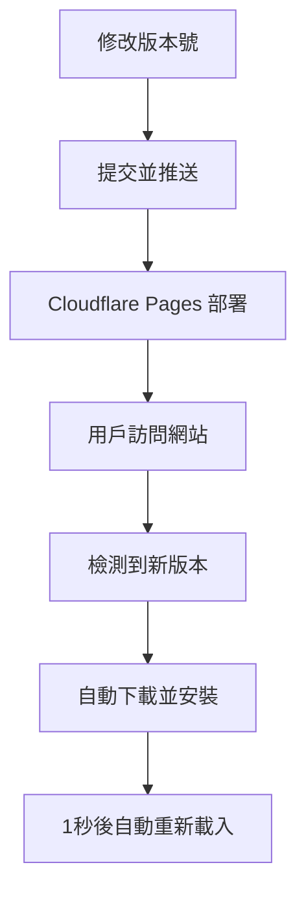

# Service Worker 版本更新指南

## 🎯 **如何更新 Service Worker 版本號**

### 1. **更新版本號**
編輯 `sw.js` 文件的第5行：

```javascript
// 🔄 更新此版本號可強制刷新緩存
const CACHE_VERSION = 'kiwi-villa-v1.3.0'; // ← 修改這裡的版本號
```

### 2. **版本號命名規則**
建議使用語義化版本：
- **主版本號**：重大功能變更 (v2.0.0)
- **次版本號**：新功能或重要更新 (v1.3.0)  
- **修訂版本號**：錯誤修復或小調整 (v1.2.1)

### 3. **常見更新情況**

| 更新內容 | 版本號變更 | 範例 |
|---------|-----------|------|
| 🔧 修復小錯誤 | +0.0.1 | v1.2.0 → v1.2.1 |
| ✨ 新增功能 | +0.1.0 | v1.2.1 → v1.3.0 |
| 🎨 重大更新 | +1.0.0 | v1.3.0 → v2.0.0 |

### 4. **自動更新流程**



## 🚀 **更新步驟**

### **步驟1：修改版本號**
```bash
# 編輯 sw.js 文件
nano sw.js

# 修改第5行的版本號
const CACHE_VERSION = 'kiwi-villa-v1.3.0'; # 新版本號
```

### **步驟2：提交變更**
```bash
git add sw.js
git commit -m "更新 Service Worker 到 v1.3.0"
git push
```

### **步驟3：等待部署**
- Cloudflare Pages 自動部署（1-2分鐘）
- 用戶下次訪問時會自動更新

## 🔍 **控制台日誌**

更新成功時，您會看到：
```
🔄 發現 Service Worker 新版本...
🎯 新版本 Service Worker 已安裝，準備更新...
🔄 Service Worker 控制權已更新，即將重新載入頁面...
📋 當前 Service Worker 版本: kiwi-villa-v1.3.0
```

## ⚡ **強制立即更新**

如果需要強制用戶立即更新：

### **方法1：清除所有緩存**
```javascript
// 在瀏覽器控制台執行
navigator.serviceWorker.getRegistrations().then(function(registrations) {
    for(let registration of registrations) {
        registration.unregister();
    }
});
```

### **方法2：硬刷新**
- **Windows**: `Ctrl + F5`
- **Mac**: `Cmd + Shift + R`

## 📋 **版本更新檢查清單**

- [ ] 更新 `CACHE_VERSION` 常數
- [ ] 檢查 `CORE_ASSETS` 列表是否需要更新
- [ ] 測試新功能是否正常運作
- [ ] 提交並推送到 GitHub
- [ ] 等待 Cloudflare Pages 部署完成
- [ ] 測試線上版本

## 🎛️ **高級配置**

### **添加新的緩存資源**
```javascript
const CORE_ASSETS = [
    // 現有資源...
    '/new-page.html',        // 新增頁面
    '/css/new-styles.css',   // 新增樣式
    '/images/new-image.webp' // 新增圖片
];
```

### **修改緩存策略**
```javascript
// 網絡優先（適合動態內容）
// 緩存優先（適合靜態資源）
// 僅網絡（適合 API 請求）
```

## 🔧 **故障排除**

### **問題1：Service Worker 不更新**
```bash
# 解決方案：增加版本號並強制刷新
const CACHE_VERSION = 'kiwi-villa-v1.4.0'; # 版本號+1
```

### **問題2：緩存過期**
```bash
# 解決方案：清除瀏覽器緩存
# Chrome: 設定 → 隱私權與安全性 → 清除瀏覽資料
```

### **問題3：無法載入資源**
```bash
# 檢查 CORE_ASSETS 路徑是否正確
# 確保檔案存在於正確位置
```

## 📱 **PWA 功能**

Service Worker 還支援：
- 🔄 離線瀏覽
- 📱 安裝到桌面
- 🔔 推送通知（未來功能）
- ⚡ 快速載入

---

**版本管理最佳實踐**：定期更新版本號，保持緩存新鮮度，提供最佳用戶體驗！ 